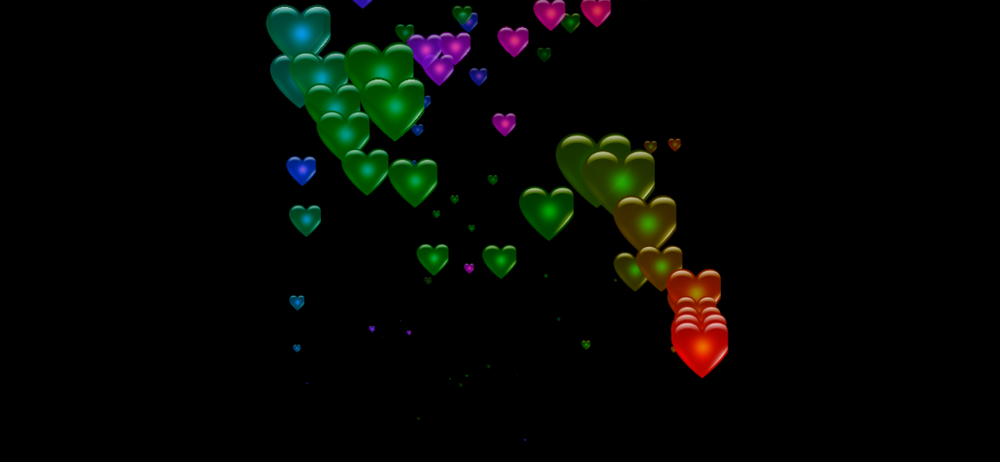

## Heart Emojis Effect

### Summary  
This project creates a dynamic and visually engaging heart trail effect that follows the user's mouse movement on the screen. Each heart appears, animates upward, and fades out over time.

### Features  
- Mouse-following heart effect  
- Random size for each heart emoji  
- Auto-removal of elements for performance  
- Smooth animation using CSS `@keyframes`

### Tech Stack  
- HTML  
- CSS (keyframe animations)  
- JavaScript (DOM manipulation, events)

### Preview 
- [live demo](https://heart-emojy.vercel.app/)
- 

### Author  
**Sohaib Kundi**  
Frontend & MERN Stack Developer  
[GitHub](https://github.com/sohaibkundi)  
[LinkedIn](https://www.linkedin.com/in/sohaibkundi2)
